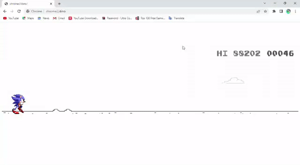

# Chrome Dyno Ofline Game Hack

## Table of Contents

- [About](#about)
- [Getting Started](#getting_started)
- [Usage](#usage)
- [Cheat Codes](#codes)
- [Authors](#authors)

***
## About 

You Can Hack The Chrome [Dyno](chrome://dino/) Game

***
## Getting Started 

Copy The Code In [src.js](./src.js)

***
## Usage 

1) Go to Chrome Browser
2) Load [chrome://dino/](chrome://dino/) URL
3) Write Click And Open **inspect**
 
    <image src=./img/inspect.PNG width=60%>
4) Click The Console
 
    <image src=./img/console.jpg width=60%>
5) Paste Code In Console And Press Enter
 
    <image src=./img/hack.PNG width=60%>
6) Now You Are Done
7) Close the **inspect** tab
8) Type Cheat codes And Get Fun

***
## ✍️ Cheat Codes 

- **cheat** - Display Cheat Menu
 
    <image src=./img/cheat_menu.PNG width=60%>
- **autoplayon** - Now Game Is Autoplaying...
 
    <image src=./img/ex-cheat.PNG width=60%>
- **autoplayoff** - Turn Off Autoplay Mod
- **sonic** - Changing the player to Sonic
- **dino** - Changing the player to Trex
- **jumpsonicon** - Changing the player to Sonic While Jumping
- **jumpsonicoff** - Turn Off jumpsonicon Cheat
- **jumpdynoon** - Changing the player to trex While Jumping 
- **jumpdinooff** - Turn Off jumpdynoon Cheat 
- **speed** - Change The Game Speed. usage: 20speed 
- **score** - Set The Score While Playing. Max core is 999999 
- **stopscore** - Stop The Score Update 
- **runscore** - Disable stopscore cheat code 
- **fastscore** - Speed up The Score Update 
- **slowscore** - Disable fastscore cheat code 
- **hack** - Freaze Game Over 

***
 

***
## ✍️ Authors 

- [@Ravindu Manoj](https://github.com/ravindu01manoj) - code